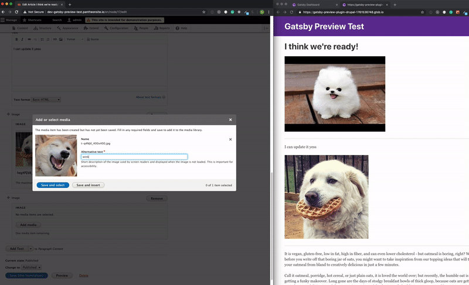

The dream, a CMS with preview and all the content bells and whistles combined with a front end that is modern, with bells and whistles of its own.

Two people will be excited about this article.

1. The developer who has been eyeing Gatsby but their clients are hesitant to leave an established workflow that includes previewing their work.

1. And the other is a content focused client who wants their site to be cutting edge, but doesn't want to leave the comfortable workflow that includes being able to see what the content will become.

These people have one major need in common: live preview with Drupal and Gatsby. Well, that day has arrived, it is now possible to have your cake (yummy Gatsby cake) and use that Drupal fork to eat it too.

An early version of Drupal Gatsby preview is available to try, all the usual caveats apply for this early version. We do not recommend this for production and if you do use this please be patient and expect hiccups. With that out of the way, let's get to the how!

## How to get started with Drupal + Gatsby preview

<iframe width="560" height="315" src="https://www.youtube.com/embed/H72PY3wNMcI" frameBorder="0" allow="accelerometer; autoplay; encrypted-media; gyroscope; picture-in-picture" allowFullScreen></iframe>

### Step 1: Sign Up for Gatsby Preview Beta

You will need to sign up for a Gatsby cloud preview beta account, so this is a meta beta. You can sign up for a [Gatsby cloud preview 14 day trial here](https://www.gatsbyjs.com/preview/?_ga=2.156650491.1704520703.1561474285-32798346.1550767689) and get more information on the [Gatsby blog](/blog/2019-03-22-introducing-gatsby-preview-beta/).

### Step 2: Turn on the Preview Flag in Gatsby Preview

The gatsby source plugin is available on [npm under the package name `gatsby-source-drupal-preview`](https://www.npmjs.com/package/gatsby-source-drupal-preview). Setup is exactly the same as the Drupal source plugin, however, you now have a `preview` flag to turn on in the options object:

```javascript:title=gatsby-config.js
module.exports = {
  plugins: [
    {
      resolve: `gatsby-source-drupal-preview`,
      options: {
        baseUrl: `...`,
        preview: true,
      },
    },
  ],
}
```

Once that flag is turned on the gatsby plugin is now listening for changes at a specific url. In your gatsby cloud instance you'll need to copy the preview URL. Once you have that, the Gatsby side is set up to receive updates.

### Step 3: Enable JSON API in Drupal

Let’s make our transition in to Drupal. First things first, enable JSON API in your drupal instance. Then get the Gatsby Preview module at [this link on drupal.org](https://www.drupal.org/project/gatsby).

Install it and enable it on your Drupal instance. Configuring the Drupal module is straightforward, under ‘Configuration > System’, you now have the option for ‘Gatsby Live Preview Settings’. The URL you copied earlier can be pasted into the ‘Gastby Preview Server URL’ and give that a save.

Now you're all set up to use preview! Make a change to your content, press save (keystroke by keystroke updates are not available yet), and watch as Gatsby updates before Drupal even notifies you that your changes have been saved.


